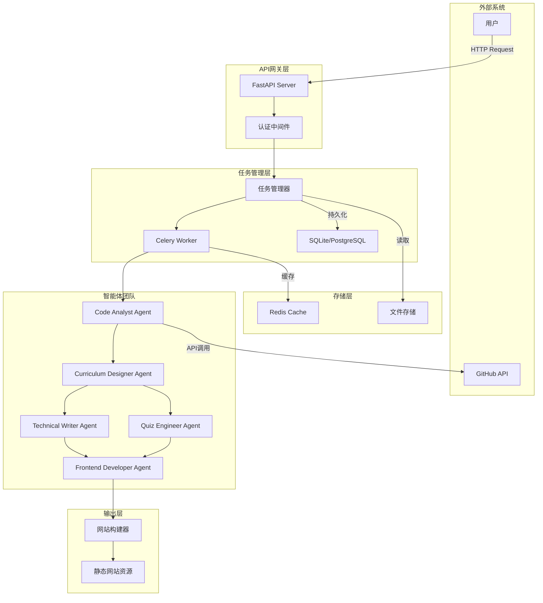
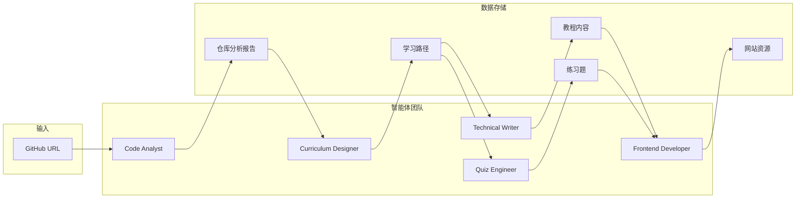
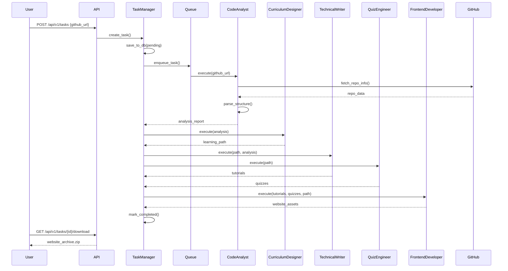
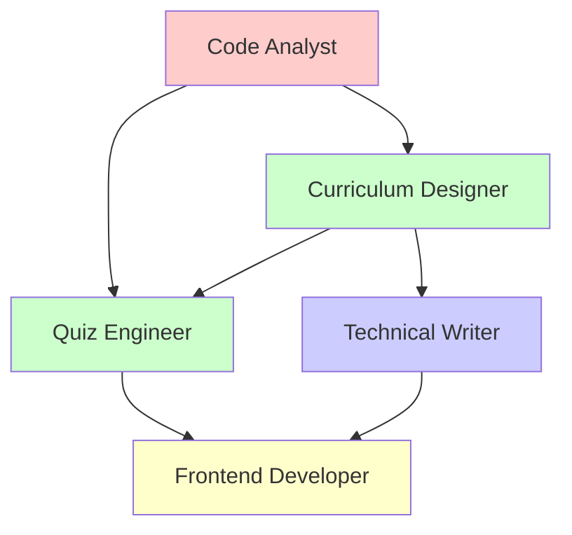
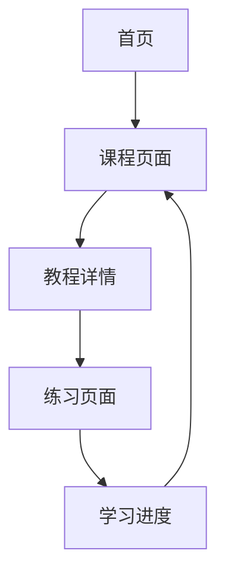

# GitHub Learning Journey Generator - Technical Design

Feature Name: github-learning-journey
Updated: 2026-03-20

## 1. Description

本系统是一个基于多智能体协作的自动化学习内容生成平台。用户输入GitHub仓库URL，系统通过代码分析、课程设计、内容生成、前端开发等多个AI智能体的协作，端到端输出一个完整的交互式学习网站。

## 2. System Architecture

### 2.1 Overall Architecture



### 2.2 Agent Team Architecture



## 3. Components and Interfaces

### 3.1 Core Components

#### 3.1.1 API Server (FastAPI)

| 组件 | 职责 | 技术选型 |
|------|------|----------|
| API Router | 路由定义和请求处理 | FastAPI |
| Auth Middleware | 认证和限流 | Custom Middleware |
| Task Controller | 任务创建、查询、取消 | Pydantic Models |
| Result Handler | 结果聚合和返回 | Response Models |

#### 3.1.2 Task Management System

| 组件 | 职责 | 技术选型 |
|------|------|----------|
| Task Manager | 任务生命周期管理 | Python asyncio |
| Task Queue | 异步任务分发 | Celery + Redis |
| Task Repository | 任务状态持久化 | SQLite |
| Progress Tracker | 任务进度追踪 | Redis |

#### 3.1.3 Agent Framework

| 组件 | 职责 | 技术选型 |
|------|------|----------|
| Agent Base Class | 智能体基类，定义接口 | ABC + Protocol |
| Agent Registry | 智能体注册和发现 | 装饰器模式 |
| Prompt Manager | 提示词模板管理 | Jinja2 |
| Output Parser | 输出解析和验证 | Pydantic |
| LLM Client | 大语言模型调用 | OpenAI API / Anthropic API |

### 3.2 Agent Specifications

#### Code Analyst Agent

```python
class CodeAnalystAgent:
    name: str = "code_analyst"
    description: str = "Analyzes GitHub repository structure and dependencies"
    
    # Input
    input_schema = {
        "github_url": "string (required)",
        "analysis_depth": "string (basic|detailed)"
    }
    
    # Output
    output_schema = {
        "repository_info": {
            "name": "string",
            "full_name": "string",
            "description": "string",
            "language": "string",
            "stars": "integer"
        },
        "file_tree": [{"path": "string", "type": "file|dir"}],
        "dependencies": {
            "manager": "string",
            "packages": ["string"]
        },
        "entry_points": [{"file": "string", "line": "integer"}],
        "core_modules": [{"name": "string", "path": "string"}]
    }
    
    # Prompts
    system_prompt: str = """
    You are an expert code analyst. Your task is to analyze GitHub repositories
    and extract structural information including:
    - Repository metadata
    - File and directory structure
    - Dependency information
    - Entry points and core modules
    
    Always provide accurate and detailed analysis.
    """
```

#### Curriculum Designer Agent

```python
class CurriculumDesignerAgent:
    name: str = "curriculum_designer"
    description: str = "Designs learning paths based on repository analysis"
    
    # Input
    input_schema = {
        "repository_analysis": "CodeAnalystOutput",
        "target_audience": "string (beginner|intermediate|advanced)"
    }
    
    # Output
    output_schema = {
        "milestones": [{
            "id": "string",
            "title": "string",
            "description": "string",
            "estimated_time": "string",
            "prerequisites": ["string"],
            "knowledge_points": [{
                "id": "string",
                "title": "string",
                "concept": "string",
                "source_files": [{"path": "string", "lines": "string"}]
            }]
        }]
    }
```

#### Technical Writer Agent

```python
class TechnicalWriterAgent:
    name: str = "technical_writer"
    description: str = "Generates tutorial content and documentation"
    
    # Input
    input_schema = {
        "learning_path": "LearningPath",
        "repository_analysis": "CodeAnalystOutput"
    }
    
    # Output
    output_schema = {
        "tutorials": [{
            "knowledge_point_id": "string",
            "title": "string",
            "content": "string (markdown)",
            "code_examples": [{
                "title": "string",
                "code": "string",
                "language": "string",
                "explanation": "string"
            }]
        }],
        "course_overview": "string (markdown)"
    }
```

#### Quiz Engineer Agent

```python
class QuizEngineerAgent:
    name: str = "quiz_engineer"
    description: str = "Creates exercises and knowledge checkpoints"
    
    # Input
    input_schema = {
        "learning_path": "LearningPath",
        "tutorials": "TutorialOutput"
    }
    
    # Output
    output_schema = {
        "quizzes": [{
            "knowledge_point_id": "string",
            "exercises": [{
                "type": "multiple_choice|practical",
                "question": "string",
                "options": ["string"],
                "answer": "string",
                "explanation": "string",
                "hints": ["string"]
            }]
        }]
    }
```

#### Frontend Developer Agent

```python
class FrontendDeveloperAgent:
    name: str = "frontend_developer"
    description: str = "Builds interactive learning website"
    
    # Input
    input_schema = {
        "tutorials": "TutorialOutput",
        "quizzes": "QuizOutput",
        "learning_path": "LearningPath"
    }
    
    # Output
    output_schema = {
        "website_assets": {
            "index.html": "string",
            "styles.css": "string",
            "app.js": "string",
            "content": {"tutorials": "json", "quizzes": "json"}
        }
    }
```

### 3.3 Interfaces

#### REST API Endpoints

| Method | Path | Description | Request | Response |
|--------|------|-------------|---------|----------|
| POST | /api/v1/tasks | 创建学习任务 | CreateTaskRequest | TaskResponse |
| GET | /api/v1/tasks/{id} | 获取任务详情 | - | TaskDetailResponse |
| GET | /api/v1/tasks | 列出任务 | ListTasksQuery | TaskListResponse |
| DELETE | /api/v1/tasks/{id} | 取消任务 | - | CancelResponse |
| GET | /api/v1/tasks/{id}/download | 下载网站包 | - | FileResponse |
| GET | /api/v1/health | 健康检查 | - | HealthResponse |

#### Internal Agent Communication

```python
# Agent Message Protocol
class AgentMessage(BaseModel):
    sender: str
    receiver: str
    task_id: str
    message_type: str  # request|response|error
    payload: dict
    timestamp: datetime
```

## 4. Data Models

### 4.1 Database Schema (SQLite)

```sql
-- Tasks Table
CREATE TABLE tasks (
    id TEXT PRIMARY KEY,
    github_url TEXT NOT NULL,
    status TEXT NOT NULL, -- pending|running|completed|failed
    progress INTEGER DEFAULT 0,
    current_agent TEXT,
    created_at TIMESTAMP DEFAULT CURRENT_TIMESTAMP,
    updated_at TIMESTAMP DEFAULT CURRENT_TIMESTAMP,
    completed_at TIMESTAMP
);

-- Task Results Table
CREATE TABLE task_results (
    id TEXT PRIMARY KEY,
    task_id TEXT NOT NULL,
    result_type TEXT NOT NULL, -- analysis|path|content|quiz|website
    result_data TEXT, -- JSON
    created_at TIMESTAMP DEFAULT CURRENT_TIMESTAMP,
    FOREIGN KEY (task_id) REFERENCES tasks(id)
);

-- Agent Logs Table
CREATE TABLE agent_logs (
    id TEXT PRIMARY KEY,
    task_id TEXT NOT NULL,
    agent_name TEXT NOT NULL,
    log_level TEXT NOT NULL,
    message TEXT,
    created_at TIMESTAMP DEFAULT CURRENT_TIMESTAMP,
    FOREIGN KEY (task_id) REFERENCES tasks(id)
);
```

### 4.2 File Storage Structure

```
/storage
├── tasks/
│   └── {task_id}/
│       ├── analysis/
│       │   └── repository_report.json
│       ├── curriculum/
│       │   └── learning_path.json
│       ├── content/
│       │   ├── overview.md
│       │   └── tutorials/
│       │       └── {knowledge_point_id}.md
│       ├── quizzes/
│       │   └── quiz_bank.json
│       └── website/
│           ├── index.html
│           ├── css/
│           ├── js/
│           └── content/
│               ├── tutorials.json
│               └── quizzes.json
```

## 5. Workflow Orchestration

### 5.1 Task Execution Flow



### 5.2 Agent Dependency Graph



## 6. Error Handling

### 6.1 Error Categories

| Category | Description | Handling Strategy |
|----------|-------------|-------------------|
| InvalidInput | 无效的GitHub URL | 验证并返回友好错误信息 |
| GitHubAPIError | GitHub API调用失败 | 重试3次，指数退避 |
| AgentExecutionError | 智能体执行失败 | 重试3次，记录日志 |
| TimeoutError | 任务超时（30分钟） | 取消任务，通知用户 |
| StorageError | 文件存储失败 | 清理并重试 |

### 6.2 Retry Policy

```python
RETRY_CONFIG = {
    "max_attempts": 3,
    "backoff_factor": 2,
    "initial_delay": 1,  # seconds
    "max_delay": 60,  # seconds
    "retry_on": [GitHubAPIError, AgentExecutionError, StorageError]
}
```

### 6.3 Fallback Strategies

1. **GitHub API Rate Limit**: 使用缓存数据或提供降级方案
2. **LLM Service Unavailable**: 切换到备用LLM提供商
3. **Large Repository**: 提供分批处理选项
4. **Complex Codebase**: 生成简化版学习路径并标注高级主题

## 7. Frontend Design

### 7.1 Page Structure



### 7.2 Component Hierarchy

```
App
├── Header
│   ├── Logo
│   ├── Navigation
│   └── ProgressIndicator
├── Sidebar
│   ├── CourseOutline
│   └── MilestoneList
├── MainContent
│   ├── TutorialViewer
│   ├── CodeBlock
│   └── QuizSection
└── Footer
    ├── PrevNextNav
    └── DownloadResources
```

### 7.3 Key UI Components

| Component | Description | Features |
|------------|-------------|----------|
| CourseOutline | 课程大纲导航 | 展开/折叠、进度显示、当前高亮 |
| TutorialViewer | 教程内容渲染 | Markdown渲染、代码高亮、目录导航 |
| CodeBlock | 代码展示块 | 语法高亮、复制按钮、运行按钮 |
| QuizCard | 练习题卡片 | 单选/多选、提交验证、答案解析 |
| ProgressBar | 进度条 | 当前进度、里程碑完成状态 |
| MilestoneCard | 里程碑卡片 | 标题、描述、包含知识点列表 |

## 8. Technology Stack Details

### 8.1 Backend Dependencies

```txt
# requirements.txt
fastapi==0.109.0
uvicorn==0.27.0
pydantic==2.5.0
celery==5.3.0
redis==5.0.0
httpx==0.26.0
PyGithub==2.1.1
openai==1.12.0
jinja2==3.1.0
python-multipart==0.0.6
aiosqlite==0.19.0
```

### 8.2 Frontend Dependencies

```json
{
  "dependencies": {
    "react": "^18.2.0",
    "react-dom": "^18.2.0",
    "react-router-dom": "^6.22.0",
    "@radix-ui/react-accordion": "^1.1.2",
    "@radix-ui/react-progress": "^1.0.3",
    "react-markdown": "^9.0.1",
    "prismjs": "^1.29.0",
    "react-syntax-highlighter": "^15.5.0",
    "monaco-editor": "^0.45.0"
  }
}
```

## 9. Deployment Architecture

### 9.1 Docker Compose Setup

```yaml
version: '3.8'
services:
  api:
    build: ./backend
    ports:
      - "8000:8000"
    depends_on:
      - redis
      - worker
    environment:
      - REDIS_URL=redis://redis:6379
      - DATABASE_URL=sqlite:///./data/tasks.db
  
  worker:
    build: ./backend
    command: celery -A app.worker worker
    depends_on:
      - redis
    environment:
      - REDIS_URL=redis://redis:6379
  
  redis:
    image: redis:7-alpine
    ports:
      - "6379:6379"
  
  nginx:
    image: nginx:alpine
    ports:
      - "80:80"
    volumes:
      - ./static:/usr/share/nginx/html
    depends_on:
      - api
```

## 10. Test Strategy

### 10.1 Unit Tests

- Agent prompt generation
- Output parsing and validation
- Data transformation functions

### 10.2 Integration Tests

- API endpoint testing
- Task workflow testing
- Agent communication testing

### 10.3 E2E Tests

- Complete task from URL to website generation
- Website functionality testing

## 11. References

- FastAPI Documentation: https://fastapi.tiangolo.com/
- Celery Documentation: https://docs.celeryproject.org/
- React Documentation: https://react.dev/
- TailwindCSS Documentation: https://tailwindcss.com/
