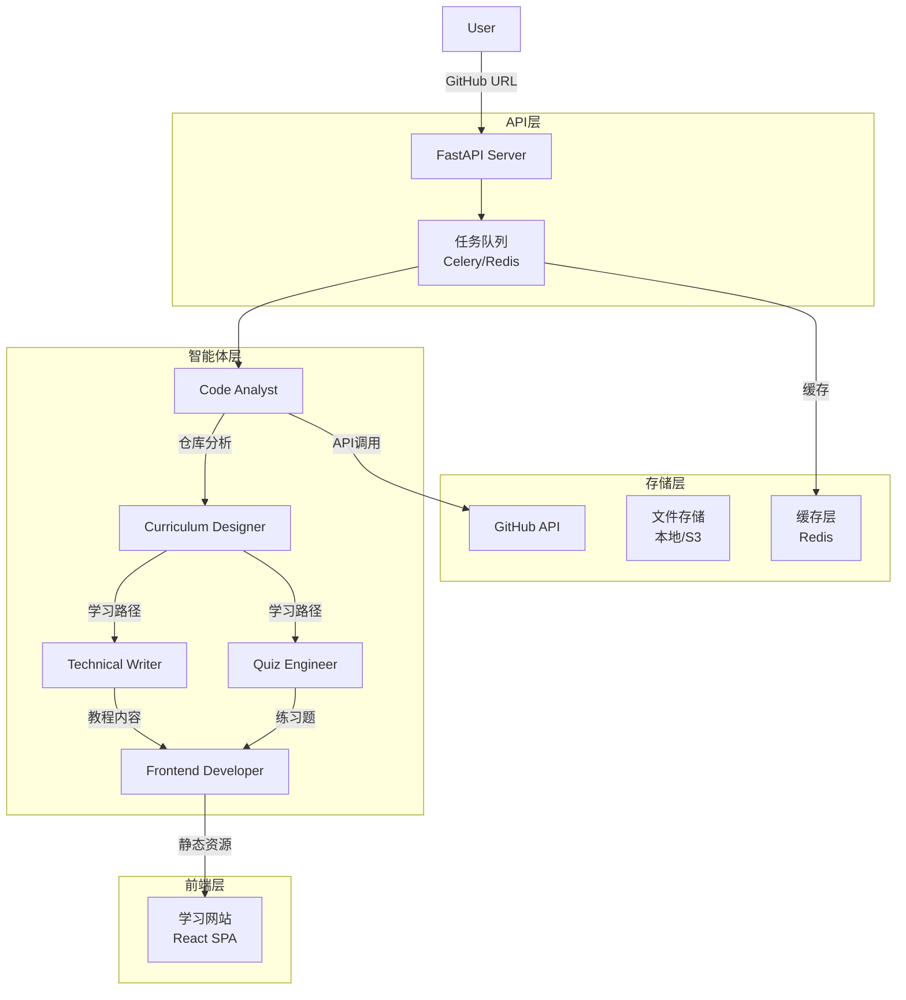

# GitHub Learning Journey Generator

## 引言

本系统旨在构建一个由多个AI智能体组成的专业团队，通过协作完成从GitHub仓库链接到完整交互式学习网站的端到端生成。用户输入任意GitHub仓库URL，系统将自动解析代码结构、设计学习路径、生成教程内容，并构建可交互的学习网站。

## 词汇表

- **Agent（智能体）**：具有特定角色、提示词和能力的AI程序单元
- **Team（团队）**：多个智能体组成的工作组织，协同完成复杂任务
- **Repository（仓库）**：GitHub代码仓库
- **Learning Path（学习路径）**：根据仓库内容设计的渐进式学习路线
- **Interactive Tutorial（交互式教程）**：包含代码示例、练习和进度追踪的在线学习网站
- **Code Playground（代码实验室）**：可在线编辑和运行代码的环境
- **Checkpoint（检查点）**：学习路径中的知识点验证节点

## 系统角色架构

### Agent Team Composition

| 角色 | 职责 | 核心能力 |
|------|------|----------|
| Code Analyst（代码分析师） | 解析GitHub仓库结构和技术栈 | GitHub API调用、代码解析、依赖分析 |
| Curriculum Designer（课程设计师） | 设计学习路径和知识图谱 | 内容规划、难度分级、学习顺序优化 |
| Technical Writer（文档工程师） | 生成教程文档和代码注释 | Markdown写作、技术说明、示例编写 |
| Quiz Engineer（题库工程师） | 创建练习题和知识检查点 | 题目设计、答案验证、难度评估 |
| Frontend Developer（前端开发者） | 构建交互式学习网站 | React/Vue开发、组件设计、用户交互 |

### Agent Communication Flow

```
User Input (GitHub URL)
         │
         ▼
┌─────────────────┐
│  Code Analyst   │ ←── 解析仓库结构和依赖
└────────┬────────┘
         │ 仓库分析报告
         ▼
┌─────────────────┐
│Curriculum Designer│ ←── 设计学习路径和里程碑
└────────┬────────┘
         │ 学习路径规划
         ▼
┌─────────────────┐
│Technical Writer │ ←── 生成教程文档和代码示例
└────────┬────────┘
         │ 教程内容
         ▼
┌─────────────────┐
│  Quiz Engineer  │ ←── 创建练习题和检查点
└────────┬────────┘
         │ 题目和答案
         ▼
┌─────────────────┐
│Frontend Developer│ ←── 构建交互式学习网站
└────────┬────────┘
         │
         ▼
   Learning Website
```

## 需求

### 需求1：GitHub仓库输入与解析

**用户故事：** 作为学习者，我想要通过输入GitHub仓库URL来启动学习流程，以便系统能自动分析仓库内容并生成学习资源。

#### Acceptance Criteria

1. WHEN 用户输入有效的GitHub仓库URL，系统 SHALL 验证URL格式并提取仓库标识符
2. WHEN 仓库标识符提取成功，系统 SHALL 调用GitHub API获取仓库元数据
3. WHEN API调用成功，Code Analyst智能体 SHALL 解析仓库结构、文件树和依赖配置文件
4. WHEN 解析完成，系统 SHALL 生成包含以下信息的仓库分析报告：
   - 仓库名称、描述、主要编程语言
   - 目录结构（文件树，深度最多5层）
   - 依赖配置文件（package.json, requirements.txt, go.mod等）
   - 入口文件和核心模块位置
5. IF GitHub API调用失败（如仓库不存在、私有仓库、无权限），系统 SHALL 显示具体的错误信息

### 需求2：学习路径设计

**用户故事：** 作为学习者，我希望能按照合理的难度顺序学习仓库中的知识，以便高效掌握核心技术。

#### Acceptance Criteria

1. WHEN Curriculum Designer收到仓库分析报告，系统 SHALL 识别核心知识点并建立知识图谱
2. WHEN 知识图谱构建完成，Curriculum Designer SHALL 设计包含以下元素的渐进式学习路径：
   - 学习里程碑（Milestone）：每个里程碑包含3-5个相关知识点
   - 里程碑之间的依赖关系
   - 每个知识点的预计学习时长
3. WHEN 学习路径设计完成，系统 SHALL 生成包含以下内容的结构化输出：
   - 里程碑列表及其顺序
   - 每个里程碑下的知识点清单
   - 知识点到具体代码文件和行号的映射
4. IF 仓库结构过于简单（少于3个核心模块），系统 SHALL 提示用户并提供简化版学习路径选项

### 需求3：教程内容生成

**用户故事：** 作为学习者，我希望获得详细的教程文档和代码示例，以便理解仓库中的核心概念和实现细节。

#### Acceptance Criteria

1. WHEN Technical Writer收到学习路径和知识点映射，系统 SHALL 为每个知识点生成Markdown格式的教程内容
2. WHEN 教程内容生成完成，每个知识点的文档 SHALL 包含：
   - 概念说明：该知识点涉及的核心概念
   - 代码解析：对应的源代码（带行号）和逐行解释
   - 实践建议：如何在实际项目中应用
3. WHEN 代码示例生成完成，系统 SHALL 为每个知识点提供可运行的代码示例
4. WHEN 所有内容生成完成，Technical Writer SHALL 生成一份课程总览文档，包含目录和章节预览
5. IF 生成过程中遇到无法理解的代码模式，系统 SHALL 在输出中标注为"高级主题"并提供外部文档链接

### 需求4：练习题与知识检查点

**用户故事：** 作为学习者，我希望通过练习题来巩固所学知识，以便确认自己真正理解了每个知识点。

#### Acceptance Criteria

1. WHEN Quiz Engineer收到学习路径和教程内容，系统 SHALL 为每个知识点设计练习题
2. WHEN 练习题生成完成，每个知识点的练习 SHALL 包含：
   - 选择题：2-3道概念理解题
   - 实践题：1-2道基于代码示例的动手练习
3. WHEN 练习题设计完成，系统 SHALL 提供标准答案和评分标准
4. WHEN 用户提交答案，系统 SHALL 自动评分并提供详细的解答说明
5. IF 题目难度与知识点不匹配，Quiz Engineer SHALL 调整题目难度使其符合渐进式学习要求

### 需求5：交互式学习网站构建

**用户故事：** 作为学习者，我希望通过一个美观的交互式网站来学习，以便获得良好的学习体验和进度追踪。

#### Acceptance Criteria

1. WHEN Frontend Developer收到教程内容、练习题和学习路径，系统 SHALL 构建一个完整的单页应用（SPA）
2. WHEN 网站构建完成，网站 SHALL 提供以下前端交互功能：
   - 教程文档展示：左侧导航目录，右侧内容区域，支持Markdown渲染
   - 代码块交互：语法高亮、一键复制、在线运行按钮（可选）
   - 章节导航：上一章/下一章导航、学习进度条
   - 练习题模块：题目展示、答案输入、提交和评分
   - 进度追踪：学习进度持久化到浏览器本地存储
3. WHEN 网站响应式设计完成，网站 SHALL 支持桌面端和移动端的正常浏览
4. WHEN 网站构建完成，系统 SHALL 生成静态资源文件（HTML/CSS/JS），可部署到任意静态托管服务
5. IF 前端开发过程中发现内容问题，系统 SHALL 记录问题并通知上游智能体重新生成

### 需求6：多智能体协作与任务调度

**用户故事：** 作为系统管理员，我希望智能体团队能自动协作完成任务，以便实现全自动化的工作流程。

#### Acceptance Criteria

1. WHEN 用户提交GitHub URL，系统 SHALL 创建新的任务实例并初始化智能体团队
2. WHEN 任务实例创建成功，系统 SHALL 按照预定义的流程协调各智能体执行任务
3. WHEN 某个智能体完成其任务，系统 SHALL 自动触发下一个依赖该输出的智能体
4. WHEN 所有智能体任务完成，系统 SHALL 汇总输出并生成最终的学习网站资源
5. IF 某个智能体执行失败，系统 SHALL 记录错误并尝试重新执行（最多3次）
6. IF 重试后仍然失败，系统 SHALL 向用户报告失败原因并提供手动干预选项

### 需求7：数据流与输出格式

**用户故事：** 作为系统，我希望各智能体之间能以标准化的格式交换数据，以便实现解耦合和可维护性。

#### Acceptance Criteria

1. WHEN 智能体之间传递数据，数据格式 SHALL 采用JSON结构
2. WHEN 仓库分析完成，Code Analyst SHALL 输出标准化的仓库分析报告（JSON Schema定义）
3. WHEN 学习路径设计完成，Curriculum Designer SHALL 输出符合预定义Schema的学习路径文档
4. WHEN 教程内容生成完成，Technical Writer SHALL 输出包含frontmatter的Markdown文件
5. WHEN 练习题生成完成，Quiz Engineer SHALL 输出符合Question Bank Schema的JSON文件

### 需求8：系统配置与扩展性

**用户故事：** 作为系统管理员，我希望系统支持灵活配置和扩展，以便适应不同的使用场景。

#### Acceptance Criteria

1. WHEN 系统初始化，系统 SHALL 支持通过配置文件定义智能体角色、提示词和能力
2. WHEN 需要添加新角色，系统 SHALL 支持注册新的智能体类型而无需修改核心代码
3. WHEN 需要调整工作流程，系统 SHALL 支持通过配置定义智能体的执行顺序和依赖关系
4. WHEN 需要自定义输出格式，系统 SHALL 支持通过模板配置生成不同格式的文档

## 技术架构

### System Architecture



### Technology Stack

| 组件 | 技术选型 |
|------|----------|
| 后端框架 | Python FastAPI |
| 任务队列 | Celery + Redis |
| 智能体框架 | 自定义Agent框架 / LangChain |
| 前端框架 | React 18 + TypeScript |
| UI组件库 | TailwindCSS + Radix UI |
| Markdown渲染 | React Markdown + Prism.js |
| 代码编辑 | Monaco Editor |
| 静态存储 | 本地文件系统 |
| 部署 | Docker |

### Data Models

#### Repository Analysis Report

```json
{
  "repository": {
    "name": "string",
    "full_name": "string",
    "description": "string",
    "language": "string",
    "stars": "number",
    "url": "string"
  },
  "structure": {
    "files": ["path/to/file"],
    "directories": ["path/to/dir"],
    "depth": "number"
  },
  "dependencies": {
    "package_manager": "string",
    "packages": ["package_name"]
  },
  "entry_points": ["file:line"],
  "core_modules": ["module_name"]
}
```

#### Learning Path

```json
{
  "milestones": [
    {
      "id": "string",
      "title": "string",
      "description": "string",
      "estimated_time": "string",
      "prerequisites": ["milestone_id"],
      "knowledge_points": [
        {
          "id": "string",
          "title": "string",
          "source_files": [{"path": "string", "lines": "string"}],
          "estimated_time": "string"
        }
      ]
    }
  ]
}
```

### API Endpoints

| Method | Endpoint | Description |
|--------|----------|-------------|
| POST | /api/tasks | 创建新的学习任务 |
| GET | /api/tasks/{task_id} | 获取任务状态 |
| GET | /api/tasks/{task_id}/result | 获取任务结果 |
| GET | /api/tasks | 列出所有任务 |
| DELETE | /api/tasks/{task_id} | 取消任务 |
| GET | /api/website/{task_id} | 下载生成的网站压缩包 |

## 验收标准

### 功能验收

1. 系统 SHALL 在用户输入有效的GitHub仓库URL后，自动在5分钟内生成完整的交互式学习网站
2. 生成的学习网站 SHALL 包含至少3个学习里程碑和10个知识点
3. 每个知识点 SHALL 包含概念说明、代码解析和至少1道练习题
4. 学习网站 SHALL 支持在现代浏览器中正常显示和交互

### 质量验收

1. 生成的教程内容 SHALL 准确反映源代码的实现逻辑
2. 代码示例 SHALL 是可运行的且输出正确结果
3. 练习题的答案 SHALL 与教程内容保持一致
4. 网站界面 SHALL 符合现代Web设计标准

### 性能验收

1. 系统 SHALL 支持同时处理至少3个并发任务
2. 单个任务的处理时间 SHALL 不超过10分钟（对于代码量少于10,000行的仓库）
3. 生成的学习网站 SHALL 在3秒内完成首屏加载
